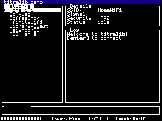

# titrmlib

[](https://github.com/gavinhsmith/titrmlib/actions/workflows/ci.yml)
[](https://gavinhsmith.github.io/titrmlib/docs/api.html)
[](https://github.com/gavinhsmith/titrmlib/blob/main/LICENSE.md)
[](https://github.com/CE-Programming/toolchain)

A terminal-style UI framework for the TI-84 Plus CE.



titrmlib takes over the calculator's screen the way curses does on a desktop
terminal. It draws a 53×30 character grid with its own 5×7 font, reads the
keypad, and runs the event loop. You build the UI as a tree of panels, give
them content, and hand control to `term_run()`. Your program never calls
graphx itself.

- **Panel tree:** split any panel into fixed, percentage or weighted-fill children, nested as deep as you need
- **Clipped output:** each panel has its own cursor, and nothing drawn in it can spill outside it
- **Focus:** your app decides which panel has focus; the focused widget gets keys first
- **Widgets:** text, selectable list, text input, scrollback log, progress bar, plus borders and titles
- **Glyphs:** box-drawing characters and small status icons (check marks, signal bars, arrows) alongside ASCII
- **Ticks:** timed events for animation and polling

## Example

```c
#include "titrm.h"

static void on_event(term_ctx_t *ctx, const term_event_t *ev, void *state) {
    (void)state;
    if (ev->type == TERM_EV_KEY && ev->key == TERM_KEY_CLEAR) {
        term_quit(ctx, 0);
    }
}

int main(void) {
    term_ctx_t *ctx = term_init();

    term_panel_t *box = term_split(term_root(ctx), TERM_VERTICAL, TERM_FILL);
    term_panel_set_border(box, true);
    term_panel_set_title(box, "titrmlib");
    term_make_text(box, "Hello from titrmlib! Press [clear] to quit.");

    term_run(ctx, on_event, NULL);
    term_shutdown(ctx);
    return 0;
}
```

`examples/demo/` is a larger program: a mock Wi-Fi manager that uses every
feature.

## Requirements

- To build: the [CE C/C++ Toolchain](https://github.com/CE-Programming/toolchain) (CEdev).
- To run: a TI-84 Plus CE with the
  [CE C libraries](https://github.com/CE-Programming/libraries/releases)
  installed, and an OS that can run C programs: 5.4 or older, or a newer OS
  jailbroken with [arTIfiCE](https://yvantt.github.io/arTIfiCE/).

## Adding it to your project

titrmlib is compiled into your program from source. Put the repository inside
your CEdev project, for example as a git submodule at `lib/titrmlib`, and add
its sources to your makefile:

```make
CFLAGS = -Wall -Wextra -Oz -Ilib/titrmlib/src
EXTRA_C_SOURCES = $(wildcard lib/titrmlib/src/*.c)
```

Keep it inside the project directory. On Windows, CEdev can't build sources
reached through `..`.

## Using it

The whole API is in [`src/titrm.h`](src/titrm.h); the [API reference](docs/api.md) lists every function, type and constant.

**Panels.** `term_split(parent, dir, size)` adds a child to a panel. `dir` is
`TERM_HORIZONTAL` (side by side) or `TERM_VERTICAL` (stacked), and every child
of a panel uses the same one. Sizes are `TERM_FIXED(cells)`,
`TERM_PERCENT(pct)`, `TERM_FILL` or `TERM_FILL_WEIGHT(w)`. Fixed and percent
sizes are taken first, then fill panels share what's left. Panels can be
hidden (`term_panel_show`) or removed (`term_panel_destroy`), and their
siblings reflow.

**Drawing.** Output is retained, like curses: what you print into a panel
with `term_panel_print`, `_printf`, `_putc`, `_move` and `_set_attr` stays
there until you overwrite it or call `term_panel_clear`. Print whenever your
state changes, typically in the update function; only the cells that changed
are redrawn. Output is clipped to the panel's content area, and only panels
without children hold content.

**Widgets** turn a panel into one with built-in content and key handling:
`term_make_text`, `term_make_list`, `term_make_input`, `term_make_log` and
`term_make_progress`. Any panel can also have a border and a title.

**Events.** Your update function receives:

- `TERM_EV_START`, once before the first frame
- `TERM_EV_KEY`, for keys the focused widget didn't use
- `TERM_EV_SUBMIT`, when the user confirms with `[enter]`: an input, or a list item (`value` is its index)
- `TERM_EV_CHANGE`, when the user changes a widget: moves a list selection or edits an input
- `TERM_EV_FOCUS_LOST`, when the focused panel is hidden or destroyed
- `TERM_EV_TICK`, every interval set with `term_set_tick(ctx, ms)`

**Focus.** Your app moves focus with `term_focus(ctx, panel)`; nothing is
focused until it does, and titrmlib never moves it on its own. `[vars]` is an
ordinary key (`TERM_KEY_VARS`), so you can use it to cycle focus, as the demo
does. Input, list and log widgets are focusable; other panels opt in with
`term_panel_set_focusable`.

**Keys.** `[alpha]` types one upper-case letter and `[2nd][alpha]` locks
alpha; `[alpha]` itself arrives as `TERM_KEY_ALPHA`, and `term_alpha_mode()`
reports the state. Held arrow keys and `[del]` repeat. `term_quit(ctx,
result)` ends `term_run()`, which returns `result`.

**Special characters.** Codes 0x80–0xFF hold box-drawing characters and
icons, named `TERM_CH_*` (e.g. `TERM_CH_CHECK`). The same characters as string
literals are `TERM_S_*`: `TERM_S_CHECK " Connected"`. The full table is in
[`src/FONT.md`](src/FONT.md).

## Limits

- One built-in font. Two colors: light on dark, with `TERM_ATTR_REVERSE` to
  invert a cell.
- Up to `TERM_MAX_PANELS` (32) panels, and `TERM_INPUT_MAX` (48) characters in
  an input field.
- `TERM_LINE_GAP` 0 gives 34 rows instead of 30, but capitals and digits then
  touch the line above.

## Documentation

- [API reference](docs/api.md)
- [CONTRIBUTING.md](CONTRIBUTING.md): development setup, building, unit and
  hardware tests, reporting issues
- [ROADMAP.md](ROADMAP.md): planned features and known issues
- [DESIGN.md](DESIGN.md): design for the next phase of work
- [src/FONT.md](src/FONT.md): character codes and glyphs
- [AGENTS.md](AGENTS.md): design notes for AI coding agents

## License

titrmlib is licensed under the Apache License 2.0 ([LICENSE.md](https://github.com/gavinhsmith/titrmlib/blob/main/LICENSE.md)).
The font is derived from [petabyt/font](https://github.com/petabyt/font) (MIT,
[tools/petabyt-font/LICENSE](https://github.com/gavinhsmith/titrmlib/blob/main/tools/petabyt-font/LICENSE)).
